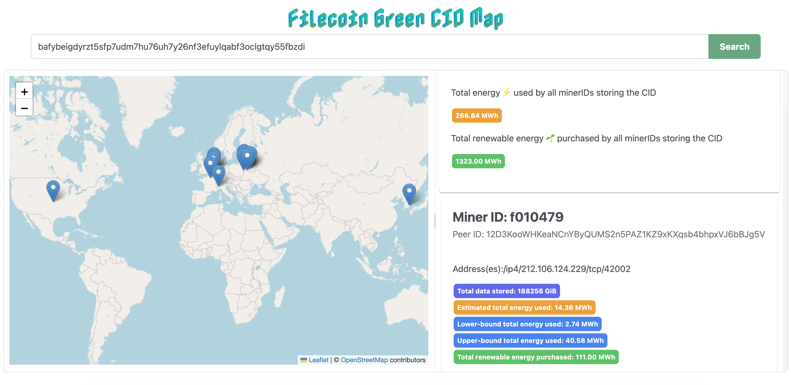

## Filecoin Green - Geographical 🗺️ and Energy Data⚡️ for a C🆔
### A UI to show geographic location, energy consumption, and renewable energy production information of a CID. 

Grant Application writeup: [link](https://docs.google.com/document/d/1kmC79qTU86A8oMZpPCGo2MPd_MCVtoQ8AEebvNw3Unk/edit?usp=sharing)

Demo: https://filecoin-green-cid-map.vercel.app/
* CID examples  
    * found: bafybeigdyrzt5sfp7udm7hu76uh7y26nf3efuylqabf3oclgtqy55fbzdi
    * error: bafybeiadla4dm75f4j46r2dhxzixofwqhglshy6brzvmnrcckzeymbmv7i

## Localhost
* `npm install` to install all dependencies   
* `npm start` to start localhost

## Libraries & Resources
* Font: https://fonts.google.com/specimen/Nabla  
    * https://material.io/blog/color-fonts-are-here
* PrimeReact: https://www.primefaces.org/primereact/
* React Leaflet: https://react-leaflet.js.org/  
    * Leaflet: https://leafletjs.com/ 
* Axios: https://axios-http.com/docs/intro 
